# 🏆 Feedants — Full-Stack Talent Competition Platform
### React Native (Expo SDK 52) • Node.js / Express (TypeScript) • MongoDB (ACID Transactions) • Redis

[](https://www.typescriptlang.org/)
[](https://expo.dev/)
[](https://nodejs.org/)
[](https://expressjs.com/)
[](https://www.mongodb.com/)
[](https://redis.io/)
[](https://jestjs.io/)
[](https://razorpay.com/)

A production-grade, pixel-perfect full-stack talent competition platform and mobile ecosystem. Engineered from the ground up featuring high-concurrency ticket/spot bookings with zero-overbooking guarantees, real-time lifecycle state machines, multi-language i18n support, and interactive Razorpay checkout.

---

## 📱 Visual Showcase & Application Tour

> All screens below are captured live from the running Expo application, backed by the Node.js TypeScript API and MongoDB database.

### 1. Flagship Screen: Competition Details & Battle Arena
The primary competition battle experience, featuring rich visual hierarchy, curated typography, dynamic countdown timers, expandable rules, and a server-driven sticky CTA.

<table align="center" width="100%">
  <tr>
    <th align="center" width="50%">English Default View</th>
    <th align="center" width="50%">हिंदी Localization (1-Tap i18n Switch)</th>
  </tr>
  <tr>
    <td align="center" valign="top">
      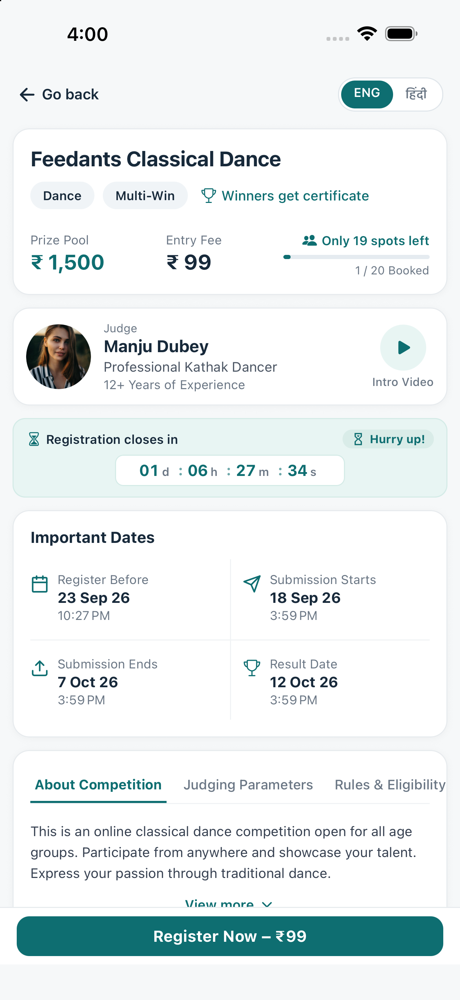
      <br/>
      <sub><b>✓ High-Fidelity UI</b>: Judge card with video modal, structured 2-row countdown timer, 2×2 dates grid, and "Register Now" CTA</sub>
    </td>
    <td align="center" valign="top">
      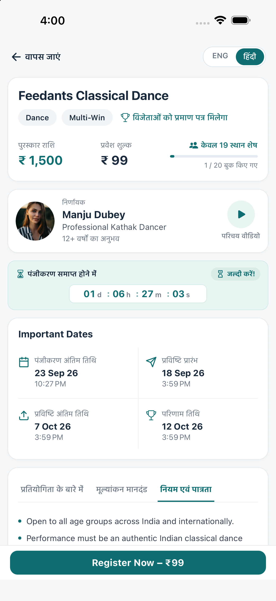
      <br/>
      <sub><b>✓ Dynamic Multi-Language</b>: Full i18next translation across all labels, buttons, countdown headers, and prize banners</sub>
    </td>
  </tr>
</table>

<br/>

### 2. Tabbed Information Architecture & Rewards Breakdown
Participants can seamlessly inspect judging parameters, comprehensive eligibility rules, and tiered prize pools.

<table align="center" width="100%">
  <tr>
    <th align="center" width="33%">Judging Parameters</th>
    <th align="center" width="33%">Rules & Eligibility</th>
    <th align="center" width="33%">Prize Pool & Tiered Rewards</th>
  </tr>
  <tr>
    <td align="center" valign="top">
      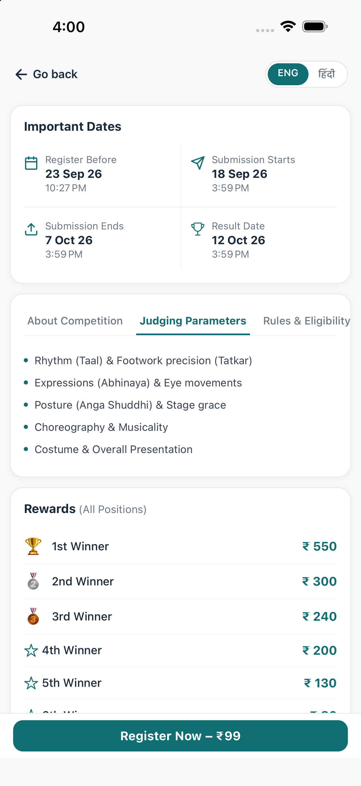
      <br/>
      <sub><b>Detailed Rubric</b>: Footwork (Tatkar), Abhinaya, Anga Shuddhi, and presentation criteria</sub>
    </td>
    <td align="center" valign="top">
      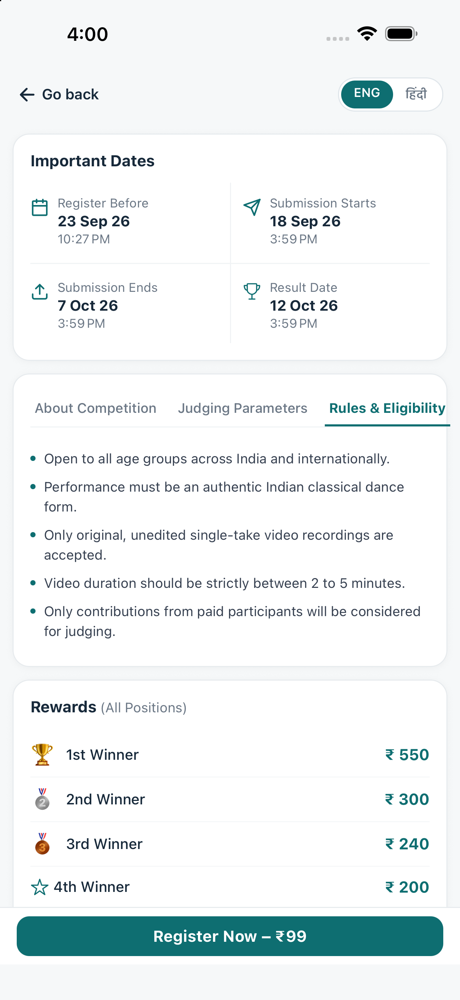
      <br/>
      <sub><b>Guidelines</b>: Age brackets, single-take video policies, and paid participant requirements</sub>
    </td>
    <td align="center" valign="top">
      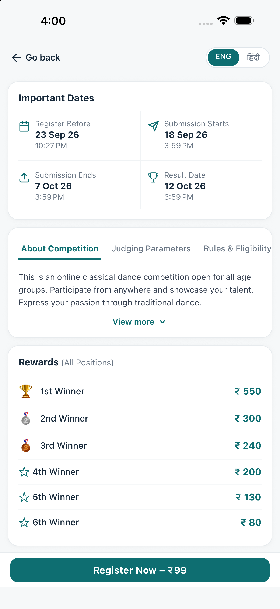
      <br/>
      <sub><b>Tiered Payouts</b>: Structured rank-wise distribution from 1st winner (₹550) to 6th winner (₹80)</sub>
    </td>
  </tr>
</table>

<br/>

### 3. End-to-End Registration & Payment Lifecycle
From spot booking through Razorpay payment verification to unlocked participant submission.

<table align="center" width="100%">
  <tr>
    <th align="center" width="33%">1. Razorpay Checkout Sheet</th>
    <th align="center" width="33%">2. Confirmed "Registered" State</th>
    <th align="center" width="33%">3. Performance Submission Flow</th>
  </tr>
  <tr>
    <td align="center" valign="top">
      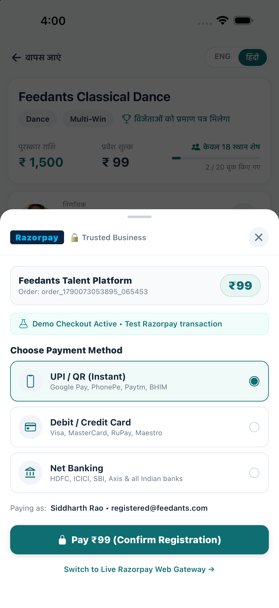
      <br/>
      <sub><b>Safe-Area Protected Modal</b>: UPI, Cards, Net Banking simulation + live gateway toggle</sub>
    </td>
    <td align="center" valign="top">
      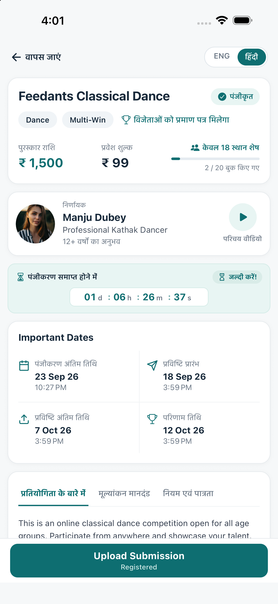
      <br/>
      <sub><b>Instant State Mutation</b>: "✓ Registered" status badge appears and CTA switches to "Upload Submission"</sub>
    </td>
    <td align="center" valign="top">
      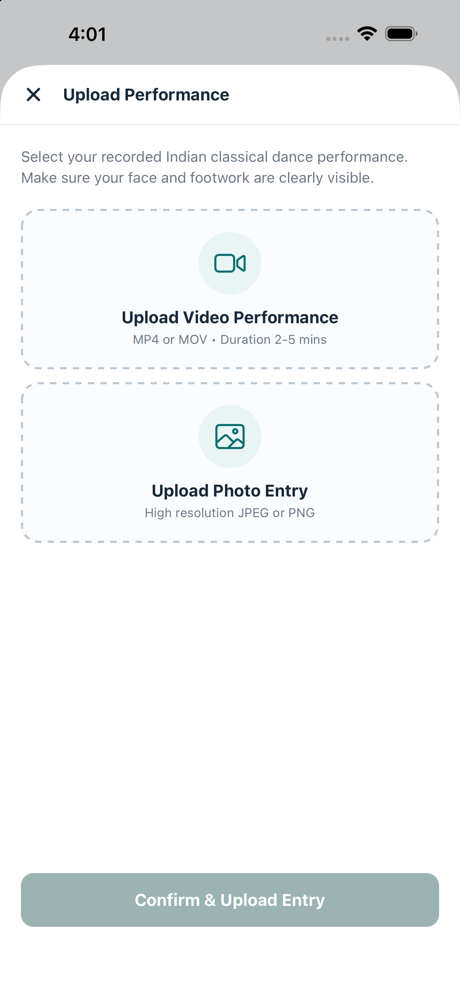
      <br/>
      <sub><b>Media Upload</b>: Video performance (MP4/MOV) and photo entry upload modal</sub>
    </td>
  </tr>
</table>

<br/>

### 4. Complete Platform Ecosystem
Complementary screens providing a cohesive, production-ready mobile application experience.

<table align="center" width="100%">
  <tr>
    <th align="center" width="25%">🏠 Home Dashboard</th>
    <th align="center" width="25%">🔍 Explore Hub</th>
    <th align="center" width="25%">🏆 Competitions List</th>
    <th align="center" width="25%">👤 User Profile</th>
  </tr>
  <tr>
    <td align="center" valign="top">
      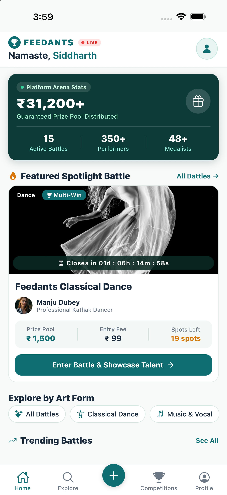
      <br/>
      <sub><b>Platform Pulse</b>: Hero prize distribution, live stats, spotlight battle, and winner video clips</sub>
    </td>
    <td align="center" valign="top">
      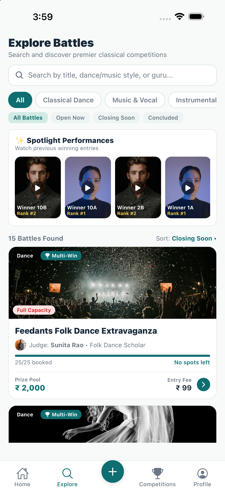
      <br/>
      <sub><b>Discovery</b>: Search bar, category chips, status pills, and spotlight video reels</sub>
    </td>
    <td align="center" valign="top">
      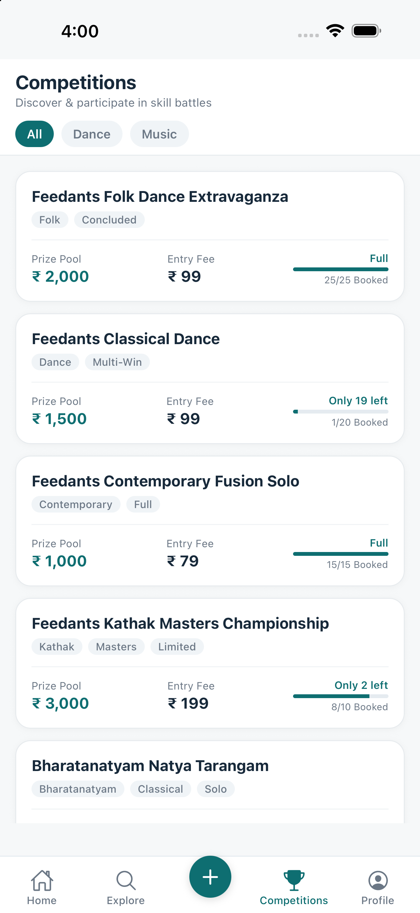
      <br/>
      <sub><b>Browse Battles</b>: Capacity bars, state badges (Full, Limited, Concluded), and entry fees</sub>
    </td>
    <td align="center" valign="top">
      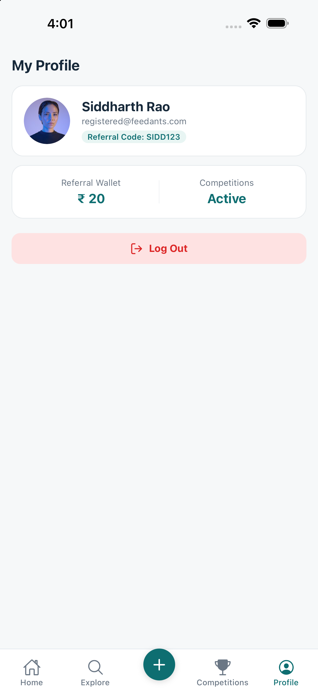
      <br/>
      <sub><b>User Hub</b>: Participation metrics, referral wallet (₹20), and session management</sub>
    </td>
  </tr>
</table>

<br/>

### 5. Creator Studio: "Host a Competition"
Organizers can configure full talent battles with timeline presets, automated prize pool distributions, and live participant previews.

<table align="center" width="100%">
  <tr>
    <th align="center" width="50%">Creator Studio Form</th>
    <th align="center" width="50%">Live Interactive Card Preview</th>
  </tr>
  <tr>
    <td align="center" valign="top">
      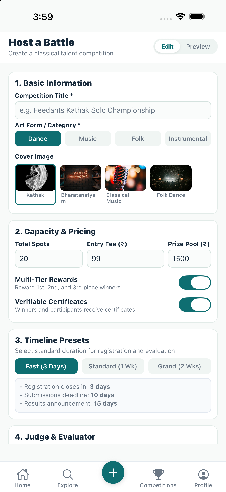
      <br/>
      <sub><b>Multi-Section Studio</b>: Category, cover picker, capacity, pricing, switches, and timeline presets</sub>
    </td>
    <td align="center" valign="top">
      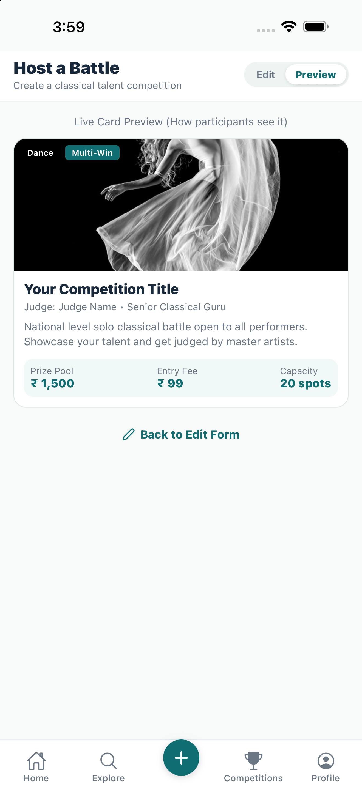
      <br/>
      <sub><b>Live WYSIWYG Preview</b>: Real-time verification of how the battle card renders to participants</sub>
    </td>
  </tr>
</table>

---

## ⚡ Quick Start (Zero External Dependencies)

This project is configured with an **automatic in-memory MongoDB replica set fallback** (`MongoMemoryReplSet`) and **in-memory Redis fallback**. You do not need to install or configure external database servers or AWS credentials to run and test the application immediately!

### 1. Prerequisites
- **Node.js**: v20+ LTS or v22/v24 LTS
- **npm**: v10+

### 2. Backend Setup & Seeding
```bash
cd backend
npm install
npm run seed      # Seeds users, reference competition, winners, and 5 distinct competition states
npm run dev       # Starts API server on http://localhost:4000 (with health check at /health)
```

### 3. Frontend Setup (Expo Mobile App)
```bash
cd app
npm install
npx expo start    # Press 'w' for Web, or scan QR code with Expo Go on iOS / Android
```

> **Testing on a Physical Device with Expo Go:**
> In `app/.env`, replace `localhost` in `EXPO_PUBLIC_API_BASE_URL` with your computer's local Wi-Fi IP address (e.g., `http://192.168.1.5:4000/api/v1`).

---

## 👥 Seeded Demo Accounts & User States

The seed script creates distinct accounts allowing you to immediately explore and test different lifecycle states:

| Account Type | Email | Password | Pre-seeded Status & Expected UI Behavior |
|---|---|---|---|
| **Registered Participant** | `registered@feedants.com` | `password123` | **Confirmed & Paid** for "Feedants Classical Dance". Displays the **✓ Registered** badge and the **Upload Submission** CTA! |
| **Fresh / New User** | `demo@feedants.com` | `password123` | **Unregistered**. Displays the **Register Now – ₹99** CTA. Tap to test spot reservation and the Razorpay payment checkout flow from scratch. |
| **Guest (Signed Out)** | *None* | *None* | Public view. No "Registered" badge. Tapping "Register Now" redirects to login and returns automatically upon authentication. |

---

## 🛡️ Concurrency Proof & Automated Test Suites

Run the complete test suite from the `backend/` directory:

```bash
cd backend

# Run all test suites (Unit, Integration, Concurrency)
npm test

# Run individual test suites
npm run test:unit           # Pure state machine & 12-row CTA decision table tests
npm run test:integration    # End-to-end API integration tests
npm run test:concurrency    # 20 simultaneous users competing for 3 remaining spots
```

### 🎯 Concurrency Stress Test Results (Zero Overbooking Guarantee)
Below is the verified test run showing **20 concurrent registration requests fired simultaneously** against a competition with exactly 3 spots left:

```text
> feedants-backend@1.0.0 test:concurrency
> jest tests/concurrency --runInBand

  console.log
    ================ CONCURRENCY TEST RESULTS ================
    Concurrent registration requests fired: 20
    Total spots initially available:        3
    Registrations succeeded:                 3
    Registrations rejected:                  17
    First failure reason: ConflictError: No spots are available for this competition
    ==========================================================

PASS tests/concurrency/registration-race.test.ts (6.304 s)
  Concurrency & Data Consistency: Registration Race Condition
    ✓ never overbooks a competition under concurrent registration attempts (20 users competing for 3 spots) (1702 ms)

Test Suites: 1 passed, 1 total
Tests:       1 passed, 1 total
Snapshots:   0 total
Time:        8.018 s
```

**Key Concurrency Invariants Proven:**
1. **Zero Overbooking**: Exactly `3` requests succeeded; `17` were cleanly rejected with `SPOTS_FULL_OR_CLOSED`.
2. **Strict Increments**: `Competition.bookedSpots` was incremented atomically from 7 to strictly 10 (never 11 or higher).
3. **Audit Trail Integrity**: Exactly 3 `Registration` records were created in the database.
4. **Transient Fault Handling**: Handled WiredTiger `WriteConflict` and `LockTimeout` via jittered backoff retries within MongoDB ACID transactions.

---

## 🧠 Key Technical Decisions & Architecture

```
                                  ┌─────────────────────────────────────────┐
                                  │      React Native (Expo SDK 52)         │
                                  │  Expo Router • TanStack Query • Zustand │
                                  └────────────────────┬────────────────────┘
                                                       │ HTTPS / REST (JWT)
                                                       ▼
                                  ┌─────────────────────────────────────────┐
                                  │          Express.js API Layer           │
                                  │   Zod Validators • Rate Limiters • Auth │
                                  └────────────┬───────────────┬────────────┘
                                               │               │
                     ┌─────────────────────────┴────┐     ┌────┴────────────────────────┐
                     ▼                              ▼     ▼                             ▼
        ┌─────────────────────────┐   ┌─────────────────────────┐         ┌─────────────────────────┐
        │   MongoDB Multi-Doc     │   │   Redis Cache & Locks   │         │    Razorpay Gateway     │
        │    ACID Transactions    │   │  (w/ In-Memory Fallback)│         │   (Web Checkout Modal)  │
        └─────────────────────────┘   └─────────────────────────┘         └─────────────────────────┘
```

### 1. Atomic Spot Reservation (`Reservation-Then-Confirm`)
Spots are reserved atomically at the start of checkout (`pending_payment`) with a 15-minute hold TTL, rather than waiting until payment confirmation.
- Uses an atomic `$inc` with `$expr: { $lt: ['$bookedSpots', '$totalSpots'] }` inside a MongoDB multi-document transaction.
- If a user abandons payment, an automated background cron job sweeps expired holds and restores spots back to the pool.
- Prevents the dreaded scenario where two users pay simultaneously for the last remaining spot.

### 2. Server-Driven CTA State Machine
The sticky bottom button logic is computed purely on the backend (`computeUserCta`) and delivered to the client as data:
- Prevents divergence between client and server business logic.
- Accommodates all 12 states of the competition lifecycle decision matrix (Unregistered, Registered, Spots Full, Registration Closed, Submission Open/Closed, Results Declared).
- Formally verified with 14 unit test cases in `backend/tests/unit/lifecycleService.test.ts`.

### 3. Safe-Area Responsive Modal System
- Custom dynamic insets calculation using `useSafeAreaInsets()`.
- Guaranteed status bar and Dynamic Island clearance (`paddingTop: Math.max(insets.top, Platform.OS === 'ios' ? 44 : StatusBar.currentHeight)`).
- Touch-friendly 32×32 circular close button with expanded hit slop and screen reader accessibility labels.

### 4. Direct-to-Storage Architecture with S3/Local Switch
- Configured with switchable storage drivers (`UPLOAD_PROVIDER=local` vs `UPLOAD_PROVIDER=s3`).
- Defaults to `local` for effortless local development and testing without AWS credentials.
- Set `UPLOAD_PROVIDER=s3` in production for direct pre-signed URL uploads that bypass the Node.js API server entirely.

### 5. Client Clock Drift Elimination
- The countdown timer is anchored to the server's clock via `serverTime` returned in `GET /competitions/:id`.
- Ensures accurate countdowns even if the user's mobile device clock is incorrect or manipulated.

---

## 📊 Summary of Trade-offs Considered

| Decision | Chosen Approach | Alternative Considered | Trade-off Rationale |
|---|---|---|---|
| **Spot Booking Model** | Reserve spot at checkout start with 15-min hold TTL | Decrement spot only upon confirmed payment | The chosen reservation model prevents collecting money from two users for one spot (avoiding awkward refunds), in exchange for brief spot hold unavailability if a checkout is abandoned. |
| **Razorpay Integration** | Standard Checkout inside safe-area Modal | Native `react-native-razorpay` SDK | Modal checkout works seamlessly in plain Expo Go and web without native prebuild steps (`npx expo prebuild`), prioritizing universal cross-platform support and zero-friction developer onboarding. |
| **State Computation** | Centralized on backend, delivered as data | Derived independently in React Native components | Centralized calculation eliminates client/server logic drift and keeps the mobile app lightweight. |
| **Live Updates** | React Query background polling (20s) + refetch on focus | Full WebSocket / Socket.io live socket | Background polling and refetch-on-focus satisfy real-time spots consistency without the connection overhead and firewall issues of standing WebSockets. |
| **Media Storage** | Switchable driver (`UPLOAD_PROVIDER=local` vs `s3`) | S3-only requirement | Allows developers and users to test full video/image uploads locally without providing AWS access keys, while keeping production S3 code ready via configuration. |

---

## 🚀 Future Production Enhancements

1. **WebSocket / SSE Live Spot Feeds**: Implement Socket.io or Server-Sent Events (SSE) to push instant spot decrement events to all connected clients when hot competitions are near capacity.
2. **Full Production Authentication**: Add Google/Apple OAuth social sign-in, SMS OTP phone verification (e.g. Twilio), password reset with signed tokens, and biometrics via `expo-local-authentication`.
3. **Admin CMS & Competition Management**: Build a web-based administrative dashboard (e.g. Next.js + Tailwind) for competition creation, judge assignment, deadline adjustments, and submission review/scoring.
4. **Automated Video Transcoding & HLS Streaming**: Integrate AWS MediaConvert or Cloudinary to automatically transcode raw user-submitted MP4/MOV videos into adaptive HLS (`.m3u8`) bitrates and auto-generate preview thumbnails.
5. **Infrastructure & Observability**: Deploy with Kubernetes/ECS behind an Application Load Balancer, configured with read replicas, Datadog/Prometheus metrics, Sentry error tracking, and automated CI/CD pipelines.

---

## 📂 Repository Structure

```
feedants-competition/
├── previews/                           # ★ High-resolution screenshots showcasing the app
│   ├── home-landing.png                # Home screen dashboard with Platform Pulse
│   ├── explore-landing.png             # Discovery hub with search, chips, and reels
│   ├── competitions-landing.png        # Competitions list with status badges
│   ├── competitions-view-top.png       # Competition battle details (Classical Dance)
│   ├── competitions-view-top-hindi.png # Hindi localization showcase
│   ├── competitions-view-judgingparam.png # Judging criteria breakdown
│   ├── competitions-view-rules.png     # Rules & eligibility guidelines
│   ├── competitions-view-bottom.png    # Important dates, rewards & CTA
│   ├── competitions-view-payment.png   # Razorpay checkout sheet modal
│   ├── competitions-view-registered.png# Registered state with "Upload Submission" CTA
│   ├── competitions-view-submission.png# Performance media upload dialog
│   ├── create-landing.png              # Host a Competition studio form
│   ├── create-preview.png              # WYSIWYG live card preview
│   └── profile-view.png                # User profile & participation metrics
├── backend/
│   ├── src/
│   │   ├── config/                     # DB (with replica set fallback), Redis, Razorpay
│   │   ├── models/                     # User, Competition, Registration, Payment, Submission
│   │   ├── services/                   # lifecycleService, registrationService, competitionService
│   │   ├── controllers/                # Express HTTP controllers
│   │   ├── routes/                     # auth, competitions, payments, referrals, webhooks
│   │   ├── middlewares/                # requireAuth, optionalAuth, validate, errorHandler
│   │   ├── jobs/                       # Expiry sweep cron job for unpaid spot holds
│   │   └── seed/                       # Deterministic seed script with 5 competition states
│   └── tests/                          # Unit, integration, and 20-user concurrency tests
├── app/
│   ├── app/                            # Expo Router file-based screens
│   │   ├── (auth)/                     # Login & Signup flows
│   │   ├── (app)/(tabs)/               # Home, Explore, Create, Competitions, Profile
│   │   └── (app)/competitions/[id]/    # ★ Competition Details, Testimonials, Submit
│   └── src/
│       ├── components/                 # ScreenHeader, CountdownBanner, ImportantDatesCard, etc.
│       ├── hooks/                      # useCompetition, useCountdown, useRegister
│       ├── store/                      # Zustand authStore
│       └── i18n/                       # English & Hindi translation dictionaries
├── docker-compose.yml                  # Optional local Mongo (rs0) & Redis services
└── README.md
```

---

## 🔑 Environment Variables Reference

### Backend (`backend/.env`)
```env
NODE_ENV=development
PORT=4000
API_BASE_PATH=/api/v1
MONGODB_URI=mongodb://127.0.0.1:27017/feedants?replicaSet=rs0
REDIS_URL=redis://127.0.0.1:6379
JWT_ACCESS_SECRET=feedants_jwt_access_secret_key_2026_dev
JWT_REFRESH_SECRET=feedants_jwt_refresh_secret_key_2026_dev
JWT_ACCESS_EXPIRES_IN=15m
JWT_REFRESH_EXPIRES_IN=30d
BCRYPT_SALT_ROUNDS=10
RAZORPAY_KEY_ID=rzp_test_1DP5mmOlF5G5ag
RAZORPAY_KEY_SECRET=rzp_test_secret_key_feedants
RAZORPAY_WEBHOOK_SECRET=rzp_webhook_secret_feedants
UPLOAD_PROVIDER=local
REGISTRATION_HOLD_TTL_MINUTES=15
REFERRAL_REWARD_AMOUNT=10
```

### Frontend (`app/.env`)
```env
EXPO_PUBLIC_API_BASE_URL=http://localhost:4000/api/v1
EXPO_PUBLIC_RAZORPAY_KEY_ID=rzp_test_1DP5mmOlF5G5ag
EXPO_PUBLIC_WEB_BASE_URL=https://feedants.com
```

---

<p align="center">
  <b>Engineered with ❤️ for Feedants</b><br/>
  <sub>Full-Stack Talent & Classical Arts Competition Ecosystem</sub>
</p>
